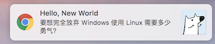
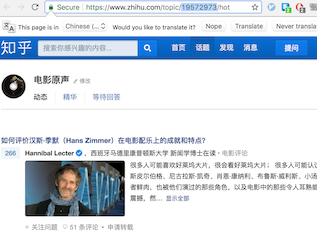
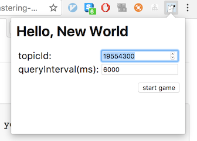

# HuzhiNotify

This is mainly for fun.

This is a chrome extension, which will interval query the zhihu/topic, and show the latest data by notification.

# How
1. download the source code.
2. follow the instruction in chrome website [load the extensions](https://developer.chrome.com/extensions/getstarted#unpacked)
3. get the topic id, and enter the target topic id just like below.

